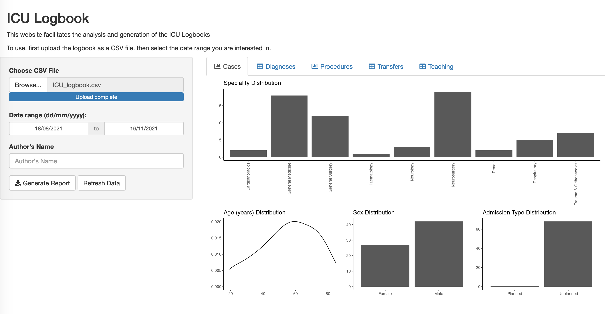

# ICU Logbook

This ShinyApp is designed to analyse and export an ICU logbook of Case Mixes, Procedures, Transfers, and Teaching.

# Installation Guide

- Have a Google account
- Make a copy of the Google Form that is designed for this Logbook, you can find form here: https://docs.google.com/forms/d/1HaQ4fAwf7zb0ppuVOUQwB2iqFwyoTi4ryhnoTEvhef0/edit?usp=sharing
- In the `Responses` tab of the Google Form, click the green icon to ensure that the Form exports to a pre-specified Google Sheet
- That's it!

# Using the Form

- Start inputting data into the Google form
- As the Form is local to your Google account, this data is private to you
- You can save a shortcut of the Form on your phone, it will scale appropriately

# Using the Logbook

Once you're ready to see what your logbook looks like, follow these steps:

- Go to your Google Sheets and find the Google Sheet that is the output of the Google Form
-- It's usually called something like `ICU Logbook (Responses)`
- Export that Google Sheet as a `comma separate values` sheet
- Upload that file to the ShinyApp to see the distributions and (optionally) generate a report.
- The URL for the app is 
- Note we do not store your data, it's all in a temporary folder that gets erased automatically.
- Once you've uploaded your CSV, it should look like:

# Examples

An example of the output of the Google Form -> Google Sheet is found at .

You can try uploading the example logbook to  to see the functionality available.
